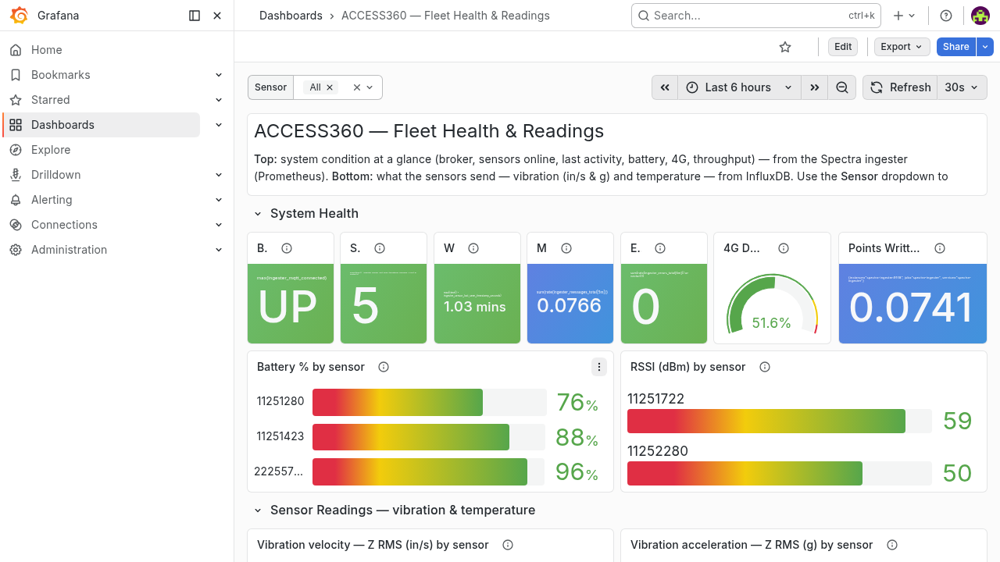
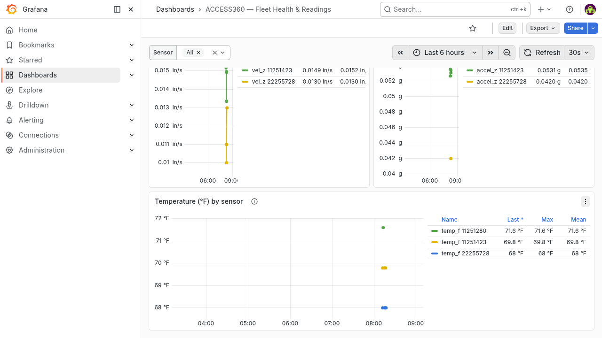

# Method 3 — Grafana Dashboard (ACCESS360 — Fleet Health & Readings)

**Tier:** Dashboard · **Platform:** Web browser (Grafana)

The featured board is **"ACCESS360 — Fleet Health & Readings"** (uid
`access360-fleet-readings`): a compact **System Health** strip on top (broker up,
sensors online, *time since last activity*, 4G usage, throughput, per-sensor battery
& RSSI) over a **Sensor Readings** section below (vibration in/s & g, and
temperature) with a **`Sensor` dropdown** to overlay all sensors (compare amplitude)
or drill into one.

> **Why not "Grafana straight from the broker"?** A broker-only board **cannot** show
> history, "time since last activity", or stored readings — Grafana Live is ephemeral
> (no backfill) and the fleet is bursty. So the dashboard reads from where data is
> durably stored: **InfluxDB 3** (sensor readings) + **Prometheus** (System Health
> KPIs).

> **Data sources — entirely from the IoT stack; the `spectra-io` ingester is NOT used
> or touched.**
> - **Sensor Readings → InfluxDB 3 `ctc43250372`** — vibration written by the
>   "CTC Vibration Observability" Node-RED flow; temperature written by the
>   [`stack-metrics/`](stack-metrics/) flow. (`spectra-ingester` / its `spectra`
>   database belong to the separate `spectra-io` project — never touched.)
> - **System Health KPIs → `iot-prometheus`** (the stack's own Prometheus, host `:9091`),
>   which scrapes a Node-RED `/metrics` exporter that computes the KPIs from the MQTT
>   stream — see [`stack-metrics/`](stack-metrics/). (`spectra-prometheus` stays on
>   `:9090` for spectra-io, untouched.)
> - **4G/SIM → Node-RED Hologram flow** publishing `access360/<gw>/sim/usage`.




## How it works

```
HiveMQ ─► iot-nodered flows ─┬─ GET /metrics ─► iot-prometheus (:9091) ─ PromQL ─► System Health (top)
                             ├─ MQTT → InfluxDB ctc43250372 ─ SQL ──────────────► Sensor Readings (bottom)
                             └─ Hologram flow → sim/usage  (4G gauges, via /metrics)
```

- **Sensor Readings (bottom):** an **InfluxDB 3** data source (SQL/FlightSQL) over
  **`ctc43250372`**. The **`$sensor`** template variable feeds
  `WHERE sensor_id IN (${sensor:singlequote})`; the **Z axis** is the cross-sensor
  comparison metric (common to single-axis WS200 and triaxial WS300).
- **System Health (top):** Prometheus KPIs from **`iot-prometheus`**, computed by the
  Node-RED `/metrics` exporter from the MQTT stream (broker up, sensors online,
  last-seen, battery, RSSI, message/error rates, 4G). Definitions/thresholds in
  [`../../docs/fleet-health-metrics.md`](../../docs/fleet-health-metrics.md).

> **Live (2026-06-23) — the dashboard is fed entirely by the IoT stack, no ingester:**
> the InfluxDB datasource is re-pointed to `ctc43250372`; temperature is ingested by the
> [`stack-metrics/`](stack-metrics/) flow; System Health is re-pointed to `iot-prometheus`
> (Node-RED exporter); 4G comes from the
> [Hologram flow](../05-sensecap-indicator-d1l/hologram-flow/).
> `spectra-ingester` / `spectra-prometheus` are untouched.

> **Two ingestion gotchas the dashboard exposed:** `dyn/temp/notify` must be
> **stored** (it was being dropped → 0 temperature rows) and dynamic-sensor readings
> carry the BLE sensors' **stuck RTC** (~5 months behind), so the ingestion must
> **clamp skewed payload timestamps to ingest time**. (See the clock-skew note in
> [`../../docs/sensors-and-gateways.md`](../../docs/sensors-and-gateways.md).)

## Prerequisites

This uses the stack's **`iot-grafana`** (Grafana **12.4.1**) — no extra container.
It needs:

- A Grafana **service-account token** (role Admin/Editor) and an **InfluxDB 3 token**
  (`INFLUX_TOKEN`) for `deploy/deploy.sh`.
- `iot-grafana` reads InfluxDB 3 (`ctc43250372`) and **`iot-prometheus`** (host `:9091`);
  both are reachable from Grafana. (`spectra-prometheus` on `:9090` is spectra-io's and
  no longer used by this dashboard.)

## What's in this folder (Phase 2 — delivered)

| Path | What it is |
|---|---|
| `dashboards/fleet-health-readings.json` | **The featured dashboard** (15 panels). DS uids templated `${DS_PROM_UID}` / `${DS_INFLUX_UID}`. |
| `deploy/gen_readings_dashboard.py` | Generator for the featured dashboard (documents every KPI/reading query). |
| `deploy/deploy.sh` | Idempotent deploy into iot-grafana: upserts the InfluxDB data source and imports the dashboard. |
| [`stack-metrics/`](stack-metrics/) | The IoT-stack System Health exporter + temperature ingest (Node-RED flow) and **`iot-prometheus`** (config/compose) — what makes the dashboard ingester-free. |
| `docs-img/fleet-health-readings-top.png` / `-bottom.png` | Screenshots of the dashboard. |

### Deploy

```bash
GRAFANA_TOKEN=<grafana-sa-token> INFLUX_TOKEN=<influx3-token> ./deploy/deploy.sh
# open http://192.168.68.150:3000/d/access360-fleet-readings
```

## Panels

**System Health (top — compact KPIs, Prometheus):** Broker up · Sensors online
(last 10 min) · Worst last-seen age (*time since last activity*) · Messages/s ·
Errors/s · 4G data used % · Points written/s · Battery % by sensor · RSSI by sensor.

**Sensor Readings (bottom — InfluxDB, `$sensor`-filtered):**

| Panel | Source | Field | Notes |
|---|---|---|---|
| Vibration velocity — Z RMS (in/s) | `vibration` | `vel_z_rms` | overlay sensors to compare amplitude |
| Vibration acceleration — Z RMS (g) | `vibration` | `z_rms` | — |
| Temperature (°F) | `sensor_health` (`metric=temperature`) | `temperature_c` → °F | stored in °C, shown in **°F** |

Z axis is the cross-sensor comparison metric (common to single-axis WS200 and
triaxial WS300). The `Sensor` dropdown is a multi-select: **All** overlays every
sensor; pick one to drill in.

## Findings

- **Verified live:** top KPIs populate (broker UP, 5 online, worst last-seen,
  battery 76/88/96 %, 4G 51.6 %); vibration overlays two sensors with distinct
  amplitude; temperature overlays three sensors (68 / 69.8 / 71.6 °F). The `$sensor`
  dropdown drills to a single sensor.
- **Two ingestion requirements this surfaced:** temperature (`dyn/temp/notify`) must
  be **stored** (it was being dropped, so no temperature rows), and dynamic-sensor
  readings carry the BLE sensors' **stuck RTC** (~5 months behind), so the ingestion
  must **clamp skewed payload timestamps to ingest time** or they land in the past.
  The stack's Node-RED ingestion must do both (store temperature in °C; clamp
  timestamps). Temperature accrues going forward — no backfill.
- **InfluxDB 3 data source quirks:** Grafana's `influxdb` (version=SQL/FlightSQL)
  reads the SQL from **`rawSql`** (not `query`), every query **must select a `time`
  column**, and results must be **time-ascending**. All queries filter
  `gateway_sn='43250372'` (excludes the synthetic `99999999` test rows).

## Still to do

- ✅ **Readings datasource → `ctc43250372`** (done).
- ✅ **Temperature ingested** by the [`stack-metrics/`](stack-metrics/) flow (write path
  verified; real WS100 temperature accrues as `proc/reading`/`dyn/temp` arrive).
- ✅ **System Health → `iot-prometheus`** (Node-RED exporter). The dashboard no longer
  depends on `spectra-io`'s ingester.
- Capture vibration/temperature over a longer window for a fuller trend.
- Optional: a `gateway_events` errors/`ap` panel; an InfluxDB "last-seen age" table.
