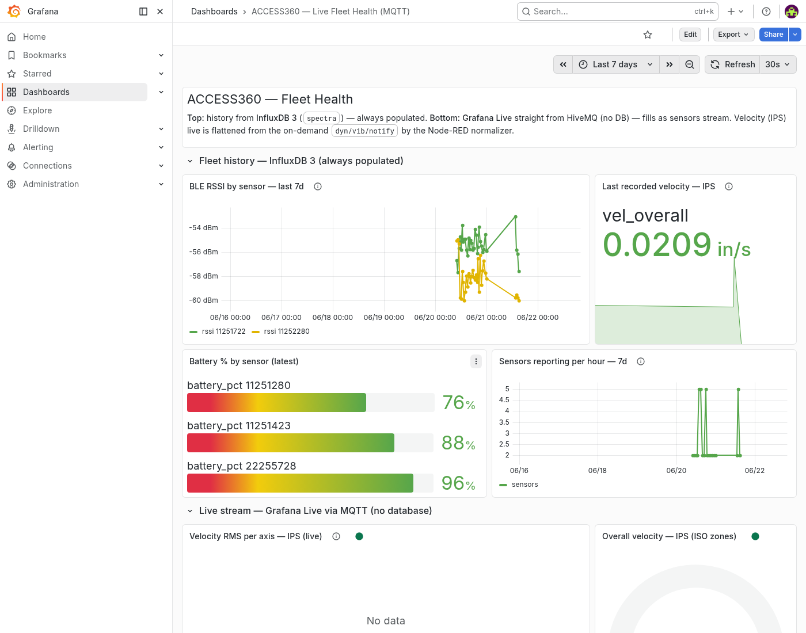
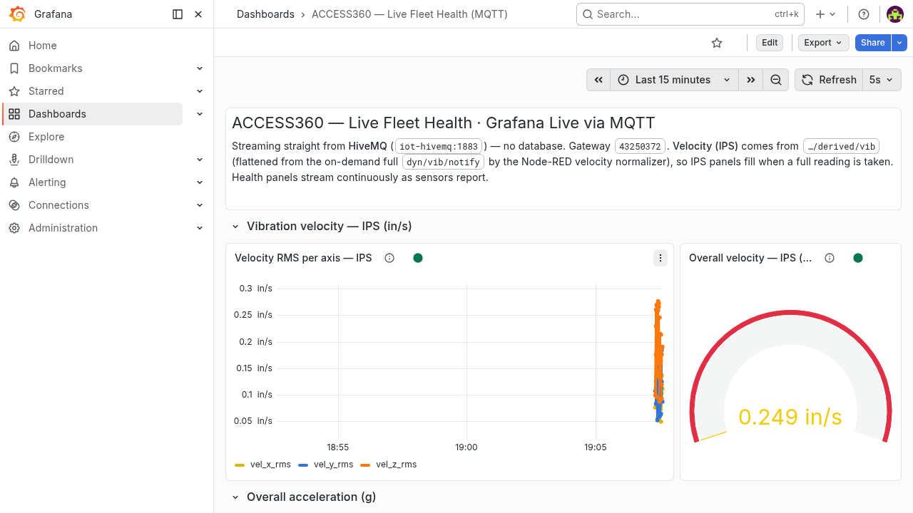

# Method 3 — Grafana Live (Web Streaming)

**Tier:** Dashboard · **Platform:** Web browser (Grafana)

A **hybrid** web dashboard: a top **"Fleet history"** section backed by InfluxDB 3
(always populated) over a bottom **"Live stream"** section fed **straight from
HiveMQ** via Grafana Live (WebSocket, no DB). Live shows the demo wow; history makes
the board useful even when the bursty fleet is quiet.

## Purpose

- A proper web dashboard for **fleet health** and **vibration / velocity (IPS)**,
  shareable by URL on the private plane.
- Live streaming (sub-second) via Grafana Live reading MQTT directly **plus**
  always-on history/trends from the InfluxDB the platform already writes.
- A stepping stone to the platform's full "Spectra Fleet Health" board.

## How it works

```
                         ┌─ Grafana MQTT data source ─ Grafana Live (WS) ─► live panels
HiveMQ (…150:1883) ──────┤
                         └─ spectra-ingester ─► InfluxDB 3 (spectra) ─ SQL ─► history panels
```

- **Live** uses the first-party
  [grafana-mqtt-datasource](https://github.com/grafana/mqtt-datasource): it
  subscribes to topics and streams each message into a Grafana Live channel.
- **History** uses an **InfluxDB 3** data source (SQL/FlightSQL) pointed at the
  `spectra` database, where the ingester persists `sensor_health` and `vibration`.

> **Why hybrid:** Grafana Live does **not** backfill — it only shows messages that
> arrive after you open a panel, and ACCESS360 sensors publish in bursts (the fleet
> can be silent for hours). A pure-live board therefore reads "No data" most of the
> time. The InfluxDB section fixes that with real history.

## Prerequisites

This **reuses the existing `iot-grafana`** on the `.150` IoT stack (Grafana
**12.4.1**) — no new container. It needs:

- The **`grafana-mqtt-datasource`** plugin (signed, in the catalog). Install once
  (this restarts Grafana):
  ```bash
  ssh root@192.168.68.150 'docker exec iot-grafana grafana cli plugins install grafana-mqtt-datasource && docker restart iot-grafana'
  ```
- A Grafana **service-account token** (role Admin/Editor) for `deploy/deploy.sh`, and
  an **InfluxDB 3 token** (`INFLUX_TOKEN`) for the history data source.
- iot-grafana already shares the `iot_iot` network with `iot-hivemq` and
  `iot-influxdb3`, so it reaches `iot-hivemq:1883` (TLS off, anonymous) and
  `iot-influxdb3:8181` (InfluxDB 3 SQL).

## What's in this folder (Phase 2 — delivered)

| Path | What it is |
|---|---|
| `provisioning/datasource.yml` | The MQTT data source (`uri: tcp://iot-hivemq:1883`), for file-provisioning or reference. |
| `dashboards/fleet-health-live.json` | The hybrid dashboard (16 panels, 2 sections). DS uids templated as `${DS_MQTT_UID}` / `${DS_INFLUX_UID}`. |
| `deploy/deploy.sh` | Idempotent deploy into the existing iot-grafana via API: upserts both data sources, imports the dashboard. |
| `deploy/gen_dashboard.py` | Generator that builds the dashboard JSON (documents how each panel is wired). |
| `normalizer/flow.json` | Node-RED flow that flattens the **live velocity (IPS)** out of `dyn/vib/notify` to a flat topic so the live panels can plot it (see below). |
| `docs-img/grafana-hybrid-history.png` | Screenshot: the always-populated InfluxDB history section (RSSI 7d, last IPS, battery, sensors/hour). |
| `docs-img/grafana-live-ips.png` | Screenshot: live velocity (IPS) — per-axis time series + ISO-zone gauge. |



### Deploy

```bash
# 1) the velocity normalizer (adds a flow to the existing iot-nodered; see normalizer/)
#    additive deploy, same pattern as methods/04-.../deploy/deploy.sh
# 2) both data sources (MQTT live + InfluxDB 3 history) + the dashboard:
GRAFANA_TOKEN=<grafana-sa-token> INFLUX_TOKEN=<influx3-token> ./deploy/deploy.sh
# open http://192.168.68.150:3000/d/access360-live
```

`INFLUX_TOKEN` is optional — omit it to deploy only the live (MQTT) half; the
history panels then read empty.

### Getting velocity (IPS) into a live dashboard — the normalizer

The headline condition-monitoring metric is **velocity in in/s (IPS)**. It only
exists in the **full `dyn/vib/notify`** record, where it is **nested under
`Reading`** (`Reading.VelXrms`…) — and the Grafana MQTT data source **does not
flatten nested JSON** (a nested panel shows *"Data is missing a number field"*).

So `normalizer/flow.json` adds a tiny Node-RED flow on the existing `iot-nodered`:
it subscribes to `dyn/vib/notify`, pulls `VelXrms/VelYrms/VelZrms` (and computes an
overall vector magnitude), and republishes a **flat** JSON to
`access360/43250372/derived/vib`. The dashboard's IPS panels read that flat topic.
This stays "straight from the broker" — the normalizer is a pass-through, not an
aggregator/DB. (Full readings are **on-demand**, so IPS panels fill when a reading
is taken; trigger one with `…/dyn/vib/trigger`.)

### Panels

**Fleet history (InfluxDB 3 — always populated):** RSSI by sensor (7d) · last
recorded velocity (IPS, ISO-zone stat) · battery % by sensor (bar gauge) · sensors
reporting per hour (7d).

**Live stream (Grafana Live / MQTT):**

| Panel | Topic | Field(s) | Type |
|---|---|---|---|
| Velocity RMS per axis — IPS | `…/derived/vib` | `vel_x_rms`,`vel_y_rms`,`vel_z_rms` (in/s) | Time series |
| Overall velocity — IPS | `…/derived/vib` | `vel_overall` (in/s) | Gauge, ISO-10816 zones |
| Acceleration RMS per axis (g) | `…/dyn/vib/notify/lite` | `Xrms`,`Yrms`,`Zrms` (g) | Time series |
| BLE RSSI by sensor | `…/rssi/notify` | `Rssi` | Time series (partitioned by `Serial`) |
| Temperature | `…/dyn/temp/notify` | `Temp` | Time series |
| Heartbeats | `…/proc/checkin/notify` | `Serial`,`Time` | Table |
| Battery % / RSSI (latest) | `…/dyn/batt/notify`, `…/rssi/notify` | `Batt`,`Rssi` | Stat |

### Findings from deploying live (2026-06-22)

- **Verified end-to-end:** the InfluxDB history section renders real data (RSSI 7d,
  battery 76/88/96 %, last IPS) and the live MQTT IPS time series + ISO gauge render
  from `…/derived/vib`. The MQTT data source reports *MQTT Connected*.
- **The "No data" cause:** the latest real RSSI was **~28 h old** at deploy time and
  Grafana Live doesn't backfill — so any live-only window read empty. History windows
  were widened to where the data lives (RSSI 7d had 3171 rows) and the InfluxDB
  section was added.
- **InfluxDB 3 data source quirks:** Grafana's `influxdb` (version=SQL/FlightSQL)
  reads the SQL from **`rawSql`** (not `query`), every query **must select a `time`
  column**, and results must be **time-ascending**. All history queries filter
  `gateway_sn='43250372'` to exclude synthetic test rows.
- **MQTT data source doesn't flatten nested JSON** → the velocity normalizer above.
  It also turns *every* JSON key into a field, so panels hide `Serial`/`ID` or pin a
  stat/gauge to one field (`/^vel_overall$/`).



## Notes

- **Streaming vs. history.** The MQTT data source streams *live* and stores nothing;
  the InfluxDB 3 section (SQL via Flight SQL — see
  [`../../docs/influx-mapping.md`](../../docs/influx-mapping.md)) provides the
  history. The live half is still the "no-DB, straight-from-broker" showcase.
- **Browser transport:** Grafana Live pushes to the browser over its own
  WebSocket; the *Grafana server* is the MQTT TCP client, so you do **not** need
  MQTT-over-WebSockets on HiveMQ for this method.
- **Waveform:** skip `dyn/vib/notify` (multipart). Use the FFT/waterfall method
  (4) for spectra.

## Still to do

- Capture a screenshot of the **live** section during real fleet activity (the live
  IPS shot was driven by synthetic readings; the fleet was quiet at deploy time).
- Optional: an `error/notify` logs panel; an InfluxDB "last seen age" per-sensor stat.
- The synthetic `99999999` test rows remain in InfluxDB (excluded by the
  `gateway_sn='43250372'` filter); purge them if/when InfluxDB 3 Core supports it.
