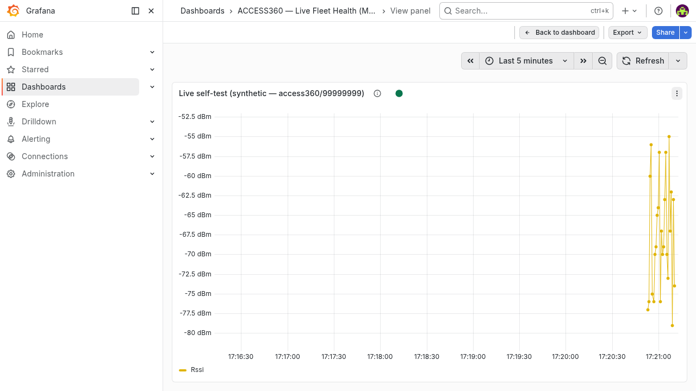

# Method 3 — Grafana Live (Web Streaming)

**Tier:** Dashboard · **Platform:** Web browser (Grafana)

Real-time streaming panels fed **straight from HiveMQ** — no database in the path.
Grafana subscribes to the MQTT topics and pushes updates to the browser over
Grafana Live (WebSocket), so values move as messages arrive.

## Purpose

- A proper web dashboard for **fleet health** and **overall vibration trends**,
  shareable by URL on the private plane.
- Live streaming (sub-second) via Grafana Live, reading MQTT directly.
- A stepping stone to the platform's full "Spectra Fleet Health" board, but with
  zero ingestion dependency — useful for demos and quick setups.

## How it works

Grafana has a first-party **MQTT data source**
([grafana-mqtt-datasource](https://github.com/grafana/mqtt-datasource)). It
connects to the broker, subscribes to topics you configure, and streams each
message into a Grafana Live channel that panels render in real time.

```
HiveMQ (192.168.68.150:1883) ──MQTT──► Grafana MQTT data source ──Grafana Live (WS)──► browser panels
```

## Prerequisites

This **reuses the existing `iot-grafana`** on the `.150` IoT stack (Grafana
**12.4.1**) — no new container. It needs:

- The **`grafana-mqtt-datasource`** plugin (signed, in the catalog). Install once
  (this restarts Grafana):
  ```bash
  ssh root@192.168.68.150 'docker exec iot-grafana grafana cli plugins install grafana-mqtt-datasource && docker restart iot-grafana'
  ```
- A Grafana **service-account token** (role Admin/Editor) for `deploy/deploy.sh`.
- iot-grafana already shares the `iot_iot` network with `iot-hivemq`, so it reaches
  the broker at `iot-hivemq:1883` (TLS off, anonymous).

## What's in this folder (Phase 2 — delivered)

| Path | What it is |
|---|---|
| `provisioning/datasource.yml` | The MQTT data source (`uri: tcp://iot-hivemq:1883`), for file-provisioning or reference. |
| `dashboards/fleet-health-live.json` | The dashboard (7 panels). The data source uid is templated as `${DS_MQTT_UID}`. |
| `deploy/deploy.sh` | Idempotent deploy into the existing iot-grafana via API: upserts the data source, imports the dashboard. |
| `deploy/gen_dashboard.py` | Generator that builds the dashboard JSON (documents how each panel is wired). |
| `docs-img/grafana-live-selftest.png` | Screenshot: a panel streaming live RSSI over Grafana Live. |

### Deploy

```bash
GRAFANA_TOKEN=<service-account-token> ./deploy/deploy.sh
# open http://192.168.68.150:3000/d/access360-live
```

### Panels (mirroring [`../../docs/fleet-health-metrics.md`](../../docs/fleet-health-metrics.md))

| Panel | Topic | Field(s) | Type |
|---|---|---|---|
| BLE RSSI — live | `…/rssi/notify` | `Rssi` | Time series |
| Sensor heartbeats — live | `…/proc/checkin/notify` | `Serial`,`Time` | Table |
| Temperature — live | `…/dyn/temp/notify` | `Temp` | Time series |
| Overall vibration RMS — live | `…/dyn/vib/notify/lite` | `Xrms`,`Yrms`,`Zrms` | Time series |
| Battery % (latest) | `…/dyn/batt/notify` | `Batt` | Stat (red `<20%`) |
| RSSI (latest) | `…/rssi/notify` | `Rssi` | Stat (red `<-80 dBm`) |

### Findings from deploying live (2026-06-22)

- **Verified end-to-end:** data source reports *MQTT Connected*; a panel renders
  streaming RSSI over Grafana Live (see screenshot). Verification used **synthetic
  messages on a throwaway gateway topic** (`access360/99999999/rssi/notify`) — the
  production ingester only subscribes to `access360/43250372/#`, so the test never
  reaches the real database.
- **Hide non-metric fields:** the MQTT data source turns *every* JSON key into a
  field, so a naive panel also plots `Serial` (e.g. `99999999`), which wrecks the
  axis. Panels hide `Serial`/`ID` (time series) or pin the stat to one field
  (`/^Rssi$/`).
- **Live-only, no backfill:** Grafana Live shows only messages that arrive *after*
  you open the panel; ACCESS360 sensors publish in **bursts** and can be quiet for
  minutes, so panels look empty until traffic flows. For history, point Grafana at
  **InfluxDB 3** instead (see Notes).
- **Nested payloads:** `proc/reading/notify` nests under `Reading`, so its fields
  aren't top-level — this dashboard uses the flat `dyn/vib/notify/lite` for overall
  RMS instead.



## Notes

- **Streaming vs. history.** The MQTT data source streams *live* — it does not
  store history. For trend/history panels, point Grafana at **InfluxDB 3** instead
  (SQL via Flight SQL; see [`../../docs/influx-mapping.md`](../../docs/influx-mapping.md)).
  This method is deliberately the no-database, live-only path.
- **Browser transport:** Grafana Live pushes to the browser over its own
  WebSocket; the *Grafana server* is the MQTT TCP client, so you do **not** need
  MQTT-over-WebSockets on HiveMQ for this method.
- **Waveform:** skip `dyn/vib/notify` (multipart). Use the FFT/waterfall method
  (4) for spectra.

## Still to do

- Capture a full-dashboard screenshot during **live fleet activity** (the committed
  shot is the single-panel self-test, since the fleet was quiet at deploy time).
- Optional: an `error/notify` logs panel and a per-sensor "last seen" stat.
