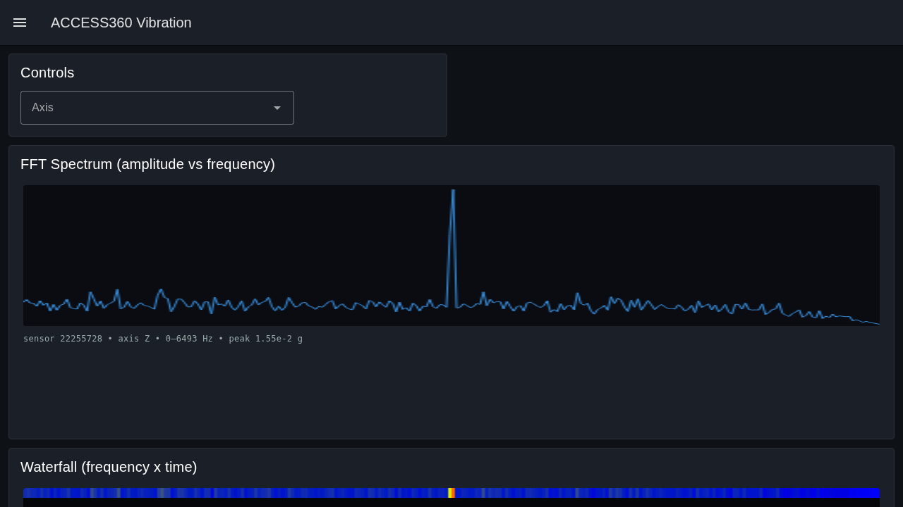
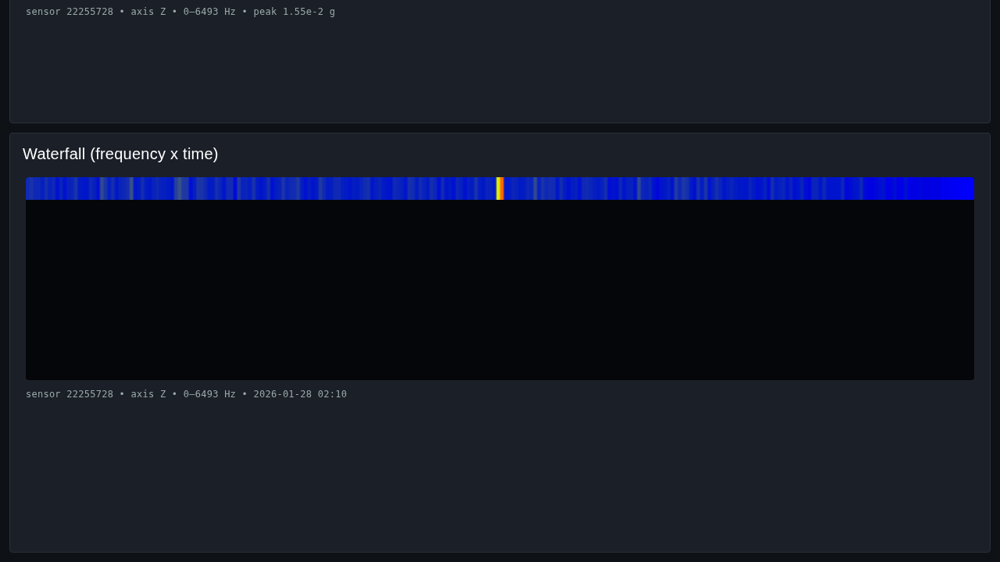

# Method 4 — Node-RED FFT / Waterfall ⭐

**Tier:** Hero (signal visualization) · **Platform:** Web browser (Node-RED Dashboard)

The headline visualization. This method consumes the **raw time-domain waveform**
on `dyn/vib/notify`, reassembles the multipart payload, computes an **FFT**, and
renders a scrolling **waterfall / spectrogram** — the frequency content of the
machine over time. This is the one that actually *shows the vibration*.

## Purpose

- Turn raw accelerometer waveforms into a **frequency-domain** view.
- Render a **waterfall (spectrogram)**: frequency on one axis, time on the other,
  amplitude as color — so emerging fault frequencies (imbalance, bearing defects,
  looseness) become visible as they develop.
- Also show a single-reading **FFT spectrum** (amplitude vs frequency) per axis.
- All fed **directly from the broker's live MQTT stream** — the FFT runs in the
  stack's Node-RED, no separate service.

## Why Node-RED

Node-RED is ideal here because the hard part is **flow logic**, not charting:
group multipart fragments → reassemble JSON → extract `X`/`Y`/`Z` + `Fs`/`Samples`
→ FFT → push a spectrum row into a heatmap. Node-RED's function nodes + dashboard
chart nodes do this with minimal code, and it already runs on the `.150` stack.

## How it works

```
access360/43250372/dyn/vib/notify (multipart fragments)
        │
        ▼  [mqtt in]  QoS 1
   [function] reassemble multipart   ← group by MultiPart_ID, concat Data, JSON.parse
        │
        ▼
   [function] extract waveform        ← X/Y/Z arrays, Fs, Samples, Serial, ID
        │
        ▼
   [function] FFT                     ← windowed real FFT → magnitude spectrum, bins → Hz
        │
        ├──► [chart: line]    FFT spectrum (amplitude vs frequency), per axis
        └──► [ui_heatmap /    waterfall: append spectrum as a new time row
              custom canvas]   (frequency × time, amplitude = color)
```

### Key signal facts (from [`../../docs/mqtt-topics.md`](../../docs/mqtt-topics.md))

- `dyn/vib/notify` carries `X`, `Y`, `Z` (raw acceleration, g) and `Plot` (time).
- `Fs` = sampling frequency (Hz), `Samples` = sample count → frequency resolution
  `df = Fs / Samples`; usable band up to Nyquist `Fs/2`.
- Live example: WS300 `22255728`, `Fs ≈ 12989 Hz`, `Samples = 6400`.
- WS200 = one axis populated; WS300 = all three.
- **Multipart is mandatory** here: reassemble `{MultiPart_ID, Data}` fragments
  before parsing — see
  [`../../docs/backend-context.md`](../../docs/backend-context.md#5-multipart-payloads-critical-for-waveformfft).

### Two ways to get the FFT

- **(A) Compute client-side (default):** run an FFT over `X`/`Y`/`Z` using `Fs`.
  Full control over windowing (Hann), units, and band. No extra round-trip.
- **(B) Ask the gateway:** publish `{ "ID": <id> }` to
  `access360/43250372/dyn/fft/get`; the response `[{ID,X,Y,Z,Plot}]` already has
  RMS magnitude per axis with `Plot` = **frequency**. Lower compute, but an extra
  request per reading.

## Prerequisites

This deploys **into the existing `iot-nodered`** on the `.150` IoT stack — no new
container. That Node-RED already has everything needed:

- **`@flowfuse/node-red-dashboard` (Dashboard 2.0)** — the `ui-*` widgets. Already
  installed; this flow targets D2.0 (Vue), not the classic Dashboard 1.x.
- The **FFT is a plain function node** (no `node-red-contrib-fft` needed) — the math
  is self-contained in the flow (mirrors `lib/fft.js`).
- The **waterfall is a `ui-template` canvas** (no heatmap palette needed).
- Reuses the existing **`iot-hivemq` broker config** node (id `a599e2ecbf5f669d`) —
  no second broker connection.
- Target sensor: WS300 `22255728` (verified live triaxial waveform).

> The production "CTC Vibration Observability" flow on the same Node-RED is left
> untouched — Method 4 is added as a separate tab + dashboard page (`/access360`).

## What's in this folder (Phase 2 — delivered)

| Path | What it is |
|---|---|
| `flow.json` | The Node-RED flow (Dashboard 2.0): `mqtt in` → reassemble+unwrap → FFT → spectrum + waterfall `ui-template`s, an axis dropdown, and an offline "Load fixture" path. |
| `lib/fft.js` | Dependency-free Hann-window + radix-2 FFT + single-sided amplitude spectrum (canonical source; the flow's FFT node embeds a copy). |
| `lib/reassemble.js` | Multipart reassembly + `Reading`-wrapper unwrap (canonical source). |
| `test/run.js` | `node test/run.js` — runs the signal core against the real fixture and asserts a sane spectrum. **No dependencies.** |
| `fixtures/ws300-dyn-vib-notify.json` | A **real** captured WS300 reading (sensor `22255728`, ~514 KB) for offline dev/test. |
| `deploy/deploy.sh` | Idempotent additive deploy into the existing `iot-nodered` via its admin API (backs up current flows first; production flow preserved). |
| `docs-img/` | Screenshots of the live dashboard (spectrum + waterfall). |

### Quick check (no Node-RED needed)

```bash
node test/run.js
# X/Y/Z spectra: Nfft=8192, df≈1.586 Hz, peaks ~3.2–3.7 kHz on the real fixture
```

### Deploy + use

```bash
./deploy/deploy.sh                 # -> POSTs the flow into iot-nodered @ .150:1880
# open http://192.168.68.150:1880/dashboard/access360   (spectrum + scrolling waterfall)
```

`deploy.sh` is additive and idempotent: it backs up the current flows, drops any
prior copy of this method, appends the Method-4 tab + `/access360` page, and POSTs —
the production "CTC Vibration" flow is preserved. One-time, copy the fixture into the
container so the offline inject works (see the header of `deploy/deploy.sh`).

Without live readings, hit the **"Load fixture"** inject (or
`curl -XPOST http://192.168.68.150:1880/inject/a360_inj`) to push the real captured
waveform through the whole pipeline. To force a fresh *live* reading, publish to
`access360/43250372/dyn/vib/trigger` (`{"Serial":22255728}`) — note the 4G cost below.

### Verified live (2026-06-22)

Deployed into `iot-nodered` and rendered on `/dashboard/access360`: the spectrum
shows the dominant peak at **~3.2 kHz** (`peak 1.55e-2 g`, axis Z, sensor 22255728)
and the waterfall scrolls. 0 console errors.




### Findings baked in from the live broker (2026-06-22)

- **`Reading` wrapper:** live `dyn/vib/notify` nests the fields under a top-level
  `Reading` object (`{"Reading":{...}}`), not flat as the vendor schema shows. The
  extract step handles both.
- **Multipart not observed here:** the ~514 KB payload arrived as a *single* whole
  message — HiveMQ on `.150` has a large enough `MaximumPacketSize`, so no
  `MultiPart_ID` fragments appeared. Reassembly is still implemented for portability.
- **6400 samples → zero-pad to 8192:** the waveform length is not a power of two, so
  the FFT Hann-windows then zero-pads to 8192. Resolution is `df = Fs/8192 ≈ 1.586 Hz`
  (Nyquist ≈ 6494 Hz at `Fs = 12989`).
- **Axis dropdown** applies to the *next* reading (the FFT runs on arrival). WS200s
  are single-axis, so only one of X/Y/Z is populated for those; WS300 has all three.

## Notes

- **Data cost.** A full waveform is ~514 KB and rides the 4G link, so triggering
  readings has a real cellular cost (see the cost model in
  [`../../docs/fleet-health-metrics.md`](../../docs/fleet-health-metrics.md)).
  Prefer on-demand triggers over a tight auto-poll for the demo.
- **Scope.** This method is *signal* visualization. The on-device health monitor
  (Method 5) deliberately does **not** draw FFTs.

## Still to do

- Capture the waterfall filling over **continuous live readings** (the committed
  shots are from repeated fixture injects, so the rows are identical).
- Optional: an on-demand **`dyn/vib/trigger` button** wired into the dashboard
  (kept out for now to avoid accidental 4G-costly triggers during the demo).
- Optional: validate amplitude scaling against approach (B) (`dyn/fft/get`), whose
  `Plot` is already in **frequency**.
